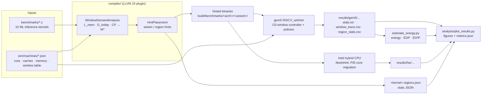

# How WinHint works

WinHint turns a static analysis of each loop nest into advisory window hints, and then
measures what those hints do on two kinds of hardware. This page shows the four parts of the
system, what each one does, and the files and encodings through which they talk to each
other. It explains the design; the commands that run it are in
[Running experiments](usage.md).

**Before you read:** [Background](../concepts/background.md) explains the out-of-order
window, MLP and the two mechanisms (gem5 window resizing, P/E-core migration).

## Overview

The parts communicate only through files and instruction encodings. Those formats are the
[cross-component contract](../interfaces.md); changing one means changing every consumer.

Read it left to right: the kernels and a machine description go into the compiler; the
compiler produces hinted binaries and a per-region report; the binaries run in gem5 or on a
hybrid CPU; the results feed the energy model and the figures.

## 1. Workloads

[`benchmarks/`](workloads.md) holds 15 portable, deterministic C11 inference kernels
(encoders, decoders, CNN/MLP contrast models, image generators, a regression control group).
Each phase (attention, FFN, layer norm, softmax, convolution and so on) is a separate
non-inlined function with its own loop nests, which is what the compiler analysis keys on.
Every kernel prints a checksum and an FNV-1a hash of its output, so a hinted build can be
checked bit-for-bit against the plain one. Each kernel accepts a `small` (training) and a
`large` (evaluation) [input](../reference/glossary.md#small-large-input).

## 2. Compiler

The [LLVM plugins](compiler.md) run on every kernel, after the optimizer, so they see
unrolled, vectorized and inlined code:

1. **`WindowDemandAnalysis`** is a static, loop-level cost model. For each top-level loop
   nest (a [region](../reference/glossary.md#region)) it estimates the miss latency per load
   class from footprint versus cache capacity ($L_{mem}$), the distance between independent
   long-latency loads ($D_{indep}$) and the critical path of the loop body ($CP$), using the
   target description in `sim/machines/*.json`. The window demand is
   $W^* = \min(W_{max}, \max(\lceil MLP_{target} \cdot D_{indep}\rceil, \lceil CP \cdot rate\rceil))$
   with $rate = \min(issue\_width, body/II)$; for issue-bound loops the critical-path term is
   $CP \cdot issue\_width$. See [Compiler, Cost model](compiler.md#cost-model).
2. **`HintPlacement`** decides where to switch. A dynamic program over the region tree
   weighs the benefit of each change against its switch cost, hoists hints out of hot loops
   and never repeats a hint that is already in force. The switch cost is a parameter, so the
   same algorithm serves cheap gem5 resizes and expensive core migrations. See
   [Compiler, Placement](compiler.md#placement).

There are two hint kinds ([Interfaces §2](../interfaces.md#2-the-hint-isa-contract)):

| Hint | Meaning | RISC-V | x86-64 |
|------|---------|--------|--------|
| `setwin(W)` | use at most a W-entry window from here on (`W = 0`: release) | `ori x0, x0, (W/8 << 5) \| 21` | `nopl 0x57481000+W/8(%rax)` |
| `region(id)` | entering static region `id` (oracle, PGO, per-region stats) | `ori x0, x0, (id << 5) \| 23` | `nopl 0x57482000+id(%rax)` |

Both are architectural no-ops on unmodified cores. For real hardware, `-winhint-emit=call`
emits calls to `__winhint_setwin` / `__winhint_region` instead, at the same places with the
same values.

Besides the binary, the pass writes `<kernel>.regions.json` (each region's source location,
model inputs and W\*) and a statistics [sidecar](../reference/glossary.md#sidecar),
`<kernel>.winhint.json` ([schema](../reference/stats-schema.md)).

The same infrastructure builds the compiler-side baselines: **B6** (Jones et al. IQ
resizing), **B7** (profile-guided positional adaptation) and **B8** (Clairvoyance). Each
build flavor is a [variant](../reference/glossary.md#variant) of the benchmarks Makefile. See
[Baselines](baselines/index.md).

## 3. Execution targets

### gem5 (RISC-V O3)

Two gem5 v25.1 builds ([gem5 model](gem5/index.md)):

- `RISCV_clean` is unmodified; the hints are plain no-ops. It is used for the bit-identical
  checks.
- `RISCV_winhint` adds the window controller in `sim/gem5/src/cpu/o3/window/`, copied into
  the gem5 tree, plus the edits to existing gem5 files in [`sim/patches/`](gem5/patches.md).

The controller resizes ROB, IQ, LQ and SQ together between the configurations of the
machine's window table ([Interfaces §3](../interfaces.md#3-window-configuration-table)). A
`setwin(W)` selects the smallest configuration with ROB ≥ W. Growing is immediate; shrinking
gates dispatch until occupancy falls under the new size. The decision
[policy](../reference/glossary.md#window-policy) is a run-time parameter: `static` (B0),
`occupancy` (B2), `mlp` (B3), `bbv` (B4), `lut` (B5), `ltp` (B9), `hint` (WinHint, and the
hint-driven baselines B1, B6, B7) and `hybrid` (WinHint + hardware). Because every policy uses
the same mechanism and table, only the decision differs. See
[Window policies](gem5/policies.md).

### Real hardware (Intel hybrid)

On an Intel Core 5 120U, `libwinhint` turns each `setwin(W)` call into a placement: a large
W moves the thread to the P-cores, a small one to the E-cores, `W = 0` restores the original
affinity. Runs are measured with RAPL against the R0–R5 baselines. See
[Real hardware](hardware/index.md).

## 4. Evaluation pipeline

The gem5 study runs in a fixed order, because later steps consume earlier products:

1. **Oracle sweep (B1).** The `oracle` build (region markers only) runs under every static
   configuration; the best configuration per region becomes the `oracle_hinted` binary, and
   the traces become B5's training data
   ([`oracle_sweep.py`](../api/python/sim/baselines/oracle/oracle_sweep.md)).
2. **B5 learned LUT** from those traces ([`sim/baselines/lut/`](../api/python/sim/baselines/lut/label_phases.md)).
3. **Fidelity and tuning** of the baselines on the `small` input
   ([Simulator fidelity](fidelity.md),
   [equal-effort tuning](../concepts/methodology.md#equal-effort-tuning)).
4. **Hinted binaries and evaluation matrix**: the per-machine hinted builds (with the tuned
   compiler knobs), then every variant × kernel × machine
   ([`run_experiments.py`](../api/python/sim/run_experiments.md)), writing
   `stats.txt`, `window_trace.csv` and `region_stats.csv` per run.
5. **Energy** per run ([`estimate_energy.py`](../api/python/sim/estimate_energy.md)).
6. **Figures** and `metrics.json`
   ([`plot_results.py`](../api/python/analysis/plot_results.md)).

The commands for each step, and for the real-hardware campaign, are in
[Running experiments](usage.md). Why each step exists is in
[Evaluation methodology](../concepts/methodology.md).

## 5. Tooling

Everything runs on the host in micromamba environments created by
[`tooling/create_conda_env.sh`](../getting-started/installation.md) and is driven by
`tooling/winhint.sh`. Correctness (every hinted variant bit-identical to plain under QEMU,
natively and in gem5) is checked by
[`tooling/verify_correctness.py`](../api/python/tooling/verify_correctness.md); see
[Testing and verification](testing.md).

## Next

- [Evaluation methodology](../concepts/methodology.md): how the claims are tested.
- [Compiler](compiler.md): the cost model and placement in detail.
- [gem5 model](gem5/index.md): the window controller and its outputs.
