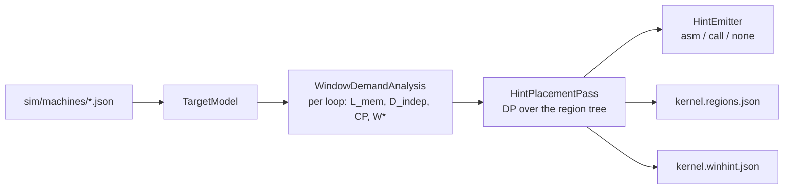

# Compiler

The compiler is where WinHint's prediction is made. An out-of-order core that keeps its full
[window](../reference/glossary.md#window) (ROB, IQ, LQ, SQ) powered all the time wastes
energy on code that cannot use it, while a core that resizes it from hardware counters reacts
only after a phase change has been detected ([Background](../concepts/background.md)). WinHint instead estimates, at compile time, how
large a window each loop needs (its [W\*](../reference/glossary.md#w)) and tells the
hardware through advisory [`setwin(W)`](../reference/glossary.md#setwin) hints. This page
documents that pass: its components, the cost model, the placement algorithm, its options and
outputs. Where it sits in the whole system is in [How WinHint works](architecture.md); how
its predictions are judged against the baselines is in
[Evaluation methodology](../concepts/methodology.md).

The compiler side is a set of out-of-tree LLVM new-pass-manager plugins, built against LLVM 23
from the `winhint` env. They read a machine description, estimate the out-of-order window
demand of every loop, and insert advisory `setwin(W)` / `region(id)` hints (the contract is in
[Interfaces §2](../interfaces.md#2-the-hint-isa-contract)).

| Plugin / library | Sources | Role |
|------------------|---------|------|
| `WinHint.so` | [`compiler/winhint/`](../../compiler/winhint) | WinHint: `WindowDemandAnalysis` + `HintPlacementPass` |
| `JonesIQ.so` | [`compiler/baselines/jones_iq/`](../../compiler/baselines/jones_iq) | B6 baseline (Jones et al., HPCA'05) |
| `WinHintCommon` (static) | [`compiler/common/`](../../compiler/common) | `TargetModel` (machine JSON) and `HintEmitter` (hint encodings), shared by both plugins |

The C++ API reference is in [api/cpp/compiler](../api/cpp/compiler/files.md).

## Components



| File | Content |
|------|---------|
| [`winhint/WindowDemandAnalysis.{h,cpp}`](../../compiler/winhint/WindowDemandAnalysis.h) | Function analysis. Builds the loop tree, trip counts (SCEV, call-site constants, or `-winhint-unknown-trip`), groups memory accesses (stream, strided, invariant, indirect, chase), computes footprints and reuse distances against the cache capacities, the dependence-DAG critical path and recurrences, and W\* per loop. Also provides `execCost()` and the libm summary table. Printer: `print<winhint-demand>`. |
| [`winhint/HintPlacement.{h,cpp}`](../../compiler/winhint/HintPlacement.h) | Module pass `winhint` (alias `winhint-place`). Numbers the regions, runs the placement dynamic program, emits hints in loop preheaders and writes the JSON outputs. |
| [`winhint/Options.{h,cpp}`](../../compiler/winhint/Options.h) | All `-winhint-*` `cl::opt`s and the cached `TargetModel` loader. |
| [`winhint/Plugin.cpp`](../../compiler/winhint/Plugin.cpp) | Registers the analysis, the pipeline names `print<winhint-demand>`, `require<winhint-demand>`, `winhint`, `winhint-place`, and (unless `-winhint-auto=false`) adds `HintPlacementPass` at the optimizer-last extension point. It is skipped in the ThinLTO/FullLTO pre-link phase. |
| [`common/TargetModel.{h,cpp}`](../../compiler/common/TargetModel.h) | Machine parameters and the window table; `configForW()` (smallest config with ROB ≥ W). |
| [`common/HintEmitter.{h,cpp}`](../../compiler/common/HintEmitter.h) | Emits hints as side-effecting inline asm (RISC-V `ori x0,x0,imm` or x86-64 `nopl disp32(%rax)`, chosen from the module triple) or as calls to `__winhint_setwin` / `__winhint_region`. Every hint carries `!winhint.hint !{i32 kind, i32 value}` metadata. |

The pass runs after the optimizer, so the model sees unrolled and vectorized loops and
inlined calls.

## In one paragraph

A loop needs a window large enough for two things: to keep enough independent cache misses in
flight to hide memory latency (memory-level parallelism), and to cover the dependence chain of
one iteration so the core is never starved of ready instructions (instruction-level
parallelism). The analysis estimates the first from the loop's memory accesses and the cache
sizes of the machine (`W_mlp`), the second from the critical path of the loop body (`W_cp`),
and takes the larger, capped by the largest window. A dynamic program over the loop tree then
decides where a `setwin` pays off: a hint is placed only when the predicted gain of the new
window outweighs the cost of switching, so short loops and repeated identical requests are
never hinted. The rest of this section states the model exactly.

## Cost model

For every loop the analysis computes three quantities (PROPOSAL §3.1):

- **`L_mem`**: the mean service latency (cycles) of the loop's independent long-latency
  loads. Each access group is assigned the first cache level whose capacity, scaled by the
  usable fraction (`effective_fraction`, default 0.75), holds its footprint or reuse
  distance. The latency of that level comes from the target model; memory is the last cache
  latency plus `MemLatency`.
- **`D_indep`**: dynamic instructions per iteration (own blocks plus inner loops) divided by
  the independent misses per iteration. Loads on a loop-carried recurrence (pointer chase,
  DependenceAnalysis flow dependence) are excluded. `null`/∞ when the loop has no such misses.
- **`CP`**: critical path (cycles) of one iteration's dependence DAG, using the per-operation
  latencies of the target model; libm calls are summarized inside the DAG.

From these, with `II = max(RecMII, body/issue_width, divider occupancy, 1)` and
`rate = min(issue_width, body / II)`:

$$
\mathrm{MLP_{target}} = \min\!\left(\mathrm{MSHR_{L1D}},\ \frac{L_{mem}\cdot \mathrm{rate}}{D_{indep}}\right)
\qquad
W_{mlp} = \lceil \mathrm{MLP_{target}} \cdot D_{indep} \rceil
$$

$$
W_{cp} = \lceil CP \cdot \mathrm{rate} \rceil
\qquad
W^{*} = \min\bigl(W_{max},\ \max(W_{mlp},\ W_{cp})\bigr)
$$

`W_max` is the largest ROB in the window table. W\* maps to the smallest window configuration
with ROB ≥ W\* (`configForW`, [interfaces.md §3](../interfaces.md#3-window-configuration-table)).

- `MLP_target` is kept fractional (it is not rounded up before multiplying by `D_indep`).
- A loop whose only long-latency loads are pointer chases gets `MLP_target = 1` and
  `W_mlp` = body size.
- `winhint.mlp_target` in the machine JSON replaces the derived `MLP_target`.
- `-winhint-cp-model=width` uses `W_cp = CP · issue_width` for every loop. The default `ii`
  (the model stated in README.md and PROPOSAL §3.1) gives the same value for issue-bound
  loops (`rate = issue_width`) and a smaller one when recurrences or dividers bound the loop.

### Placement

`HintPlacementPass` (mode `setwin`) solves a dynamic program over the region tree: loop nests
plus call-graph summaries, with callees solved first. Its states are the window
configurations plus an "unknown" state (function entry). For each child loop it compares "no
hint" with `setwin(c)` in the child's preheader, which costs one hint execution plus a switch
cost `S_eff = S · (1 + hysteresis)` if `c` differs from the state in force. Execution cost per
config is

$$
\mathrm{cost} = \frac{\mathrm{insts}}{\mathrm{IPC_0}\cdot\min(1,\ ROB_c/W^{*})}\cdot\Bigl(1 + w_E\,\frac{ROB_c}{W_{max}}\Bigr),
\qquad \mathrm{IPC_0} = \max(1,\ \mathrm{issue\_width}/2)
$$

with `w_E` = `-winhint-energy-weight`. Hoisting falls out of the DP, and redundant hints are
never emitted. Loops whose work per entry is below `-winhint-min-region-insts` are never
hinted.

Default switch cost `S`:

- `gem5` model: `winhint.switch_cost_cycles` if set, else `10 + W_max / 2 / commit_width`.
- `pe` model: `migration_us · 1000 · clock_GHz`.
- `-winhint-switch-cost` > 0 overrides both.

## Target model (machine JSON)

`-winhint-target=<json>` loads a `sim/machines/*.json` file into `TargetModel`. Every field is
optional; missing ones keep the built-in defaults, which describe `riscv_ooo`. If the file
cannot be read, a warning is printed and the built-in machine is used. The fields read by the
compiler are listed below; gem5-only fields such as `fetch_width` or `l1i` are ignored.

| JSON key | `TargetModel` field | Default |
|----------|---------------------|---------|
| `name` | `Name` (else the file path) | `builtin-default` |
| `cpu.issue_width` | `IssueWidth` | 4 |
| `cpu.dispatch_width`, else `cpu.decode_width`, else issue width | `DispatchWidth` | 4 |
| `cpu.commit_width` | `CommitWidth` | 4 |
| `cpu.clock` (`"2GHz"`, `"800MHz"`) | `ClockGHz` | 2.0 |
| `cache.line_size` / `cache.cache_line_size` | `LineSize` | 64 |
| `cache.l1d`, `cache.l2`, `cache.l3` objects: `size`, `hit_latency_cycles` (or `latency`) | `Caches` | L1D 32 KiB / 4 cyc, L2 256 KiB / 14 cyc |
| flat `cache.l1d_size`, `l1d_latency`/`l1d_hit_latency` or `l1d_{tag,data,response}_latency` (same for `l2`, `l3`) | `Caches` (only if no nested objects) | — |
| `cache.l1d.mshrs`, `cache.l1d_mshrs`, `cache.mshrs` | `L1DMSHRs` | 16 |
| `cache.l1d_prefetcher` / `l2_prefetcher` / `prefetcher` (not `none`) | `StridePrefetcher` | false |
| `cache.effective_fraction` | `CacheEffectiveFraction` | 0.75 |
| `memory.latency_cycles`, else `latency_ns` · clock, else `latency` | `MemLatency` (L2 miss round trip) | 150 |
| `cpu.latency_cycles` (or top-level `latency`): `int_alu int_mul int_div fp_add fp_mul fp_fma fp_div fp_sqrt fp_cvt store branch call` | `OpLatencies` | 1 3 20 4 4 5 12 24 3 1 1 5 |
| `cpu.latency_cycles.load_hit` | L1D latency | — |
| `fu.fp_div_units`, `fu.int_div_units` (or under `cpu.fu`) | non-pipelined dividers | 2, 2 |
| `window.rob/iq/lq/sq` parallel arrays, or `window.configs` / an array of `{rob, iq, lq, sq}` | `Window` (sorted by ROB; IQ/LQ/SQ default to ROB/2, ROB/4, ROB/4) | 64/128/192/256 table of interfaces.md §3 |
| `winhint.mlp_target`, `winhint.switch_cost_cycles`, `winhint.memory_latency_cycles`, `winhint.l1d_mshrs` | model overrides | unset |

The three machines, their schema and the gem5 side are described in the
[gem5 guide](gem5/index.md#machine-descriptions).

## Command-line options

With clang, pass each option as `-mllvm -winhint-…` and load the plugin with both `-fplugin=`
and `-fpass-plugin=`. The `-fplugin=` load makes clang `dlopen` the library before it parses
`-mllvm`, so the options are registered. With `opt`, pass them directly (`-winhint-…`).

| Option | Default | Meaning |
|--------|---------|---------|
| `-winhint-target=<json>` | empty (built-in machine) | Machine description, `sim/machines/*.json`. |
| `-winhint-mode=` | `setwin` | `setwin` (alias `model`): cost model + DP placement. `regions`: only `region(id)` markers at each top-level loop nest. `from-json=<file>`: `region(id)` + `setwin(W)` per region from a map. `off`: do nothing. An unknown value is a fatal error. |
| `-winhint-emit=` | `asm` | `asm` (ISA hint chosen from the triple; RISC-V or x86-64 only, otherwise a warning and no hints), `call` (`__winhint_setwin(W)` / `__winhint_region(id)`), `none`. |
| `-winhint-switch-cost=<cycles>` | 0 | Window switch cost; 0 = derive from the switch model. |
| `-winhint-switch-model=` | `gem5` | `gem5` (resize + drain) or `pe` (P/E-core migration). |
| `-winhint-migration-us=<µs>` | 50 | P/E migration cost, used with `-winhint-switch-model=pe`. |
| `-winhint-hysteresis=<f>` | 0.25 | Relative margin a switch must win by (`S_eff = S·(1+f)`). |
| `-winhint-hint-cost=<cycles>` | 0 | Cost of one executed hint; 0 = 1 in `asm` mode, 8 in `call` mode. |
| `-winhint-energy-weight=<f>` | 0.15 | Relative power of the full window vs. the core (cost of oversizing). |
| `-winhint-min-region-insts=<n>` | 0 | Never hint a loop with less work per entry; 0 = 2·W_max. |
| `-winhint-unknown-trip=<n>` | 1000 | Trip count assumed for loops with unknown bounds. |
| `-winhint-cp-model=` | `ii` | `ii`: `W_cp = CP·min(issue_width, body/II)`; `width`: `W_cp = CP·issue_width`. Other values are fatal. |
| `-winhint-out-dir=<dir>` | empty | Directory for `<kernel>.regions.json` and `<kernel>.winhint.json`. |
| `-winhint-stats-file=<path>` | empty | Explicit stats JSON path (default `<out-dir>/<kernel>.winhint.json`). |
| `-winhint-kernel=<name>` | source stem | Kernel name used in output file names. |
| `-winhint-region-markers` | false | Also emit `region(id)` markers in `setwin` / `from-json` mode. |
| `-winhint-verbose` | false | Print placement decisions to stderr. |
| `-winhint-auto` | true | Add the pass at the optimizer-last extension point. Set to `false` to run it only via `-passes=winhint`. |

If neither `-winhint-out-dir` nor `-winhint-stats-file` is set, no JSON is written.

### `from-json` map format

The root (or its `"regions"` member) is either an object keyed by decimal region id or an
array of objects carrying `"region"`/`"id"`. A value may be one of:

- an integer config index (negative = release);
- the string `"release"`;
- an object with `W`/`w`/`rob`/`window` (entries) or `config`/`best_config` (index).

Config indices are clamped to the table and mapped to their ROB. This is the format written by
`oracle_sweep.py` (B1) and `pgo_flow.py select` (B7).

## Build

```bash
# same as JOBS=1 compiler/build.sh
tooling/winhint.sh compiler:build
# → build/compiler/WinHint.so, build/compiler/JonesIQ.so
compiler/build.sh
# same, from the benchmarks Makefile
make -C benchmarks plugins
```

`compiler/build.sh` re-executes itself under `micromamba run -n winhint` when `llvm-config`
or `CONDA_PREFIX` is missing. It then runs CMake (Ninja, Release, `LLVM_DIR` from
`llvm-config --cmakedir`) and `ninja -j$JOBS`. Environment overrides:

| Variable | Default |
|----------|---------|
| `WINHINT_ROOT` | repository root |
| `WINHINT_BUILD` | `$WINHINT_ROOT/build` |
| `COMPILER_BUILD` | `$WINHINT_BUILD/compiler` |
| `JOBS` | 1 |
| `CXX` | `clang++` from the env |

`compiler/CMakeLists.txt` requires the LLVM major version pinned in `tooling/versions.lock`
(`LLVM=`; override with `-DWINHINT_LLVM_MAJOR=`) and at least LLVM 21. JonesIQ is built from
`compiler/baselines/jones_iq/CMakeLists.txt`, linked against `WinHintCommon`. That file can
also be built standalone.

## Running

As used by [`benchmarks/Makefile`](../../benchmarks/Makefile) (variant `winhint`, RISC-V):

```bash
SO=build/compiler/WinHint.so
clang -O2 -std=c11 -gline-tables-only \
  --target=riscv64-conda-linux-gnu --sysroot=$CONDA_PREFIX/riscv64-conda-linux-gnu/sysroot \
  --gcc-toolchain=$CONDA_PREFIX -march=rv64gc -mabi=lp64d \
  -fplugin=$SO -fpass-plugin=$SO \
  -mllvm -winhint-target=sim/machines/riscv_ooo.json -mllvm -winhint-emit=asm \
  -mllvm -winhint-out-dir=out -mllvm -winhint-kernel=encoder_bert_tiny_infer \
  -mllvm -winhint-mode=setwin \
  benchmarks/encoder_bert_tiny_infer.c -o out/encoder_bert_tiny_infer -static -fuse-ld=lld -lm
```

Use `-gline-tables-only` (or `-g`) so that the `line` fields of the JSON outputs are filled.
Other variants change only `-winhint-mode` (`regions`, `from-json=<map>`) or the emission
mode; see [Workloads](workloads.md#variants).

With `opt`, on IR:

```bash
clang -O2 -S -emit-llvm $WINHINT_RISCV_CLANG_FLAGS x.c -o x.ll
# per-loop model
opt -load-pass-plugin=build/compiler/WinHint.so -passes='print<winhint-demand>' \
    -disable-output -winhint-target=sim/machines/riscv_ooo.json x.ll
# placement: hinted IR and the JSON outputs in out/
opt -load-pass-plugin=build/compiler/WinHint.so -passes=winhint \
    -winhint-target=sim/machines/riscv_ooo.json -winhint-out-dir=out x.ll -S -o x.hinted.ll
```

`print<winhint-demand>` prints, per loop, the trip count, body, access groups and one
`WINHINT fn=… W*=…` line; the lit tests in [`compiler/test/lit/`](../../compiler/test/lit)
check these lines (see [Testing](testing.md)).

## Outputs

| Output | Where | Reference |
|--------|-------|-----------|
| Hint instructions (`ori x0,x0,imm` with tag 21/23, x86 `nopl 0x5748….(%rax)`, or runtime calls) | in the binary, loop preheaders | [interfaces.md §2](../interfaces.md#2-the-hint-isa-contract) |
| `<kernel>.regions.json` | `-winhint-out-dir` | below |
| `<kernel>.winhint.json` (`"schema": "winhint-stats/1"`) | `-winhint-out-dir` or `-winhint-stats-file` | [Stats schema](../reference/stats-schema.md) |

`setwin` payloads hold `ceil(W/8)` (6 bits), so the emitted W is a multiple of 8. The placer
emits the ROB size of the chosen configuration.

**Regions** are the top-level loop nests of every defined function. Functions are sorted by
name, and the nests inside each are numbered in program order. Ids are deterministic for a
given IR, so the `oracle`, `oracle_hinted`, `pgo` and `winhint` builds of one source at one
`-O` level agree. Ids ≥ 63 share the marker `region(63)` (`encoded_id`, `"overflow": true`).
`<kernel>.regions.json` maps each id to:

- `function`, `header`, `line`, `encoded_id`;
- `w_star`, `nest_w_star` (the dynamic-instruction-weighted W\* of the nest, used as the
  predicted window), `config`, `nest_config`;
- `L_mem`, `D_indep`, `CP`, `footprint_bytes`, `dyn_insts_est`, `conservative`.

Its consumers are the B1 oracle, B7 and `analysis/plot_results.py`.

## Compiler baselines

| ID | Baseline | Implementation | Page |
|----|----------|----------------|------|
| B6 | Compiler-directed IQ resizing (Jones et al., HPCA'05) | `JonesIQ.so`, pass `jones-iq`; Makefile variants `jones` (`-jones-mode=iq`) and `jones_full` (`-jones-mode=full`, ROB+IQ+LQ+SQ) | [Jones IQ](baselines/jones-iq.md) |
| B7 | Profile-guided positional adaptation (Huang et al., ISCA'03) | [`compiler/baselines/pgo/pgo_flow.py`](../../compiler/baselines/pgo/pgo_flow.py) `profile`/`select`/`build`/`all`; the map is consumed by `-winhint-mode=from-json=` (variant `pgo`) | [Baselines](baselines/index.md) |
| B8 | Clairvoyance (Tran et al., CGO'17) | LLVM 3.8 passes from the public artifact (env `winhint-llvm38`), [`compiler/baselines/clairvoyance/cv_compile.sh`](../../compiler/baselines/clairvoyance/cv_compile.sh); variants `clairvoyance` and `winhint_clairvoyance` | [Clairvoyance](baselines/clairvoyance.md) |

`JonesIQ.so` options (pass as `-mllvm` with clang):

| Option | Default | Meaning |
|--------|---------|---------|
| `-jones-target=<json>` | empty | Machine JSON. |
| `-jones-mode=` | `iq` | `iq` (IQ demand only, as published) or `full` (ROB, IQ, LQ, SQ jointly). |
| `-jones-iq-encoding=` | `setwin` | `setwin`: W = ROB of the smallest config whose IQ covers the demand. `setiq`: proposed IQ-only tag (RISC-V tag 25, x86 kind 3), **not** part of the contract. |
| `-jones-emit=` | `asm` | `asm`, `call`, `none`. |
| `-jones-min-block=<n>` | 8 | Minimum instructions for a basic-block region. |
| `-jones-loop-insts=<n>` | 96 | Replicate loop bodies up to this many instructions. |
| `-jones-tolerance=<f>` | 0 | Allowed schedule lengthening (fraction). |
| `-jones-out-dir=<dir>` | empty | Writes `<kernel>.jones.json` (`.jones_full.json` in full mode). |
| `-jones-kernel=<name>` | source stem | Kernel name. |
| `-jones-auto` | true | Run at the optimizer-last extension point. |
| `-jones-verbose` | false | Print regions to stderr. |

## Next

- [gem5 model](gem5/index.md): how the simulated core acts on the hints.
- [Compiler statistics](../reference/stats-schema.md): the `<kernel>.winhint.json` schema.
