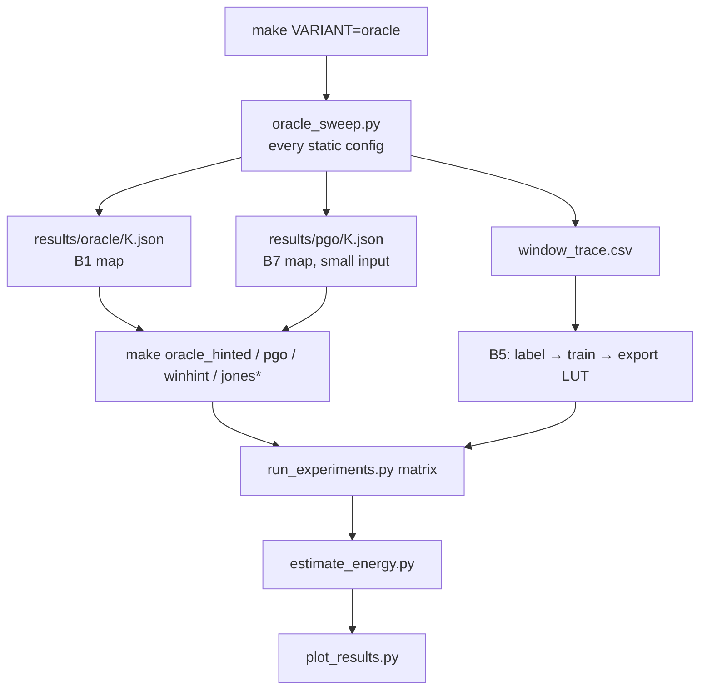

# gem5 model

The simulator side of the evaluation runs WinHint and every gem5 baseline in gem5 v25.1.0.0
(syscall-emulation mode, RISC-V, out-of-order O3 core) with window resizing added to the O3
CPU. This page explains how that mechanism is modeled and is the configuration reference for
[`sim/se.py`](../../../sim/se.py), the machine descriptions, the statistics and the run
lengths. Why gem5 is one of the two evaluation platforms, and what a gem5 result is allowed to
claim, is in [Evaluation methodology](../../concepts/methodology.md). The binding interface
(SimObject parameters, outputs) is [interfaces.md §4](../../interfaces.md#4-gem5-interface-riscv_winhint-build).

**Before you read:** [How WinHint works](../architecture.md) introduces the hint and the
window. The commands that run the study, in order, are in
[Running experiments, Part 1](../usage.md#part-1-gem5-evaluation); this page explains what
they configure.

## Terms

| Term | Meaning |
|------|---------|
| window | the ROB, IQ, LQ and SQ of the O3 core, resized together |
| configuration | one row *i* of the machine's window table (`c0` smallest … `c3` largest) |
| cap | the size a configuration allows a structure; the physical structure stays at the largest size |
| window policy | the run-time logic that picks a configuration (`--window-policy`) |
| hint | `setwin(W)` or `region(id)`, encoded as a RISC-V no-op ([interfaces.md §2](../../interfaces.md#2-the-hint-isa-contract)) |
| region | a top-level loop nest; its id is carried by `region(id)` markers |
| outdir | the directory a gem5 run writes (`--outdir`) |

Other terms are in the [Glossary](../../reference/glossary.md).

## How the window is modeled

- **Physically maximal structures.** ROB, IQ, LQ and SQ are built at the size of the largest
  configuration; a configuration only sets caps. The free-entry count each stage sees is the
  minimum of the physical free entries and `cap − occupancy`.
- **Grow and shrink.** Growing takes effect at once. Shrinking flushes nothing: dispatch
  stalls until every structure has drained to its new cap (`drainCycles` counts those
  cycles).
- **Hints at commit.** Stock gem5 already decodes `ori x0, x0, IMM` as the no-op `ori_hint`,
  so the decoder is untouched. The window controller recognises a hint from the committed
  instruction word, which makes detection non-speculative.
- **One mechanism for everyone.** WinHint and every baseline differ only in the policy and in
  the binary; the resize mechanism, the statistics and the machine are shared.

The source-level changes are in [gem5 patches](patches.md); the policies are in
[Window policies](policies.md); where this model departs from the proposal and from the
papers is in [Deviations](../../deviations.md#infrastructure).

## The two builds

| Build | Binary (under `build/gem5/src/build/`) | Use |
|-------|----------------------------------------|-----|
| `RISCV_clean` | `RISCV_clean/gem5.opt` | bit-identical checks |
| `RISCV_winhint` | `RISCV_winhint/gem5.opt` | every experiment script |

- **`RISCV_clean`** is unmodified gem5. Hints are plain no-ops (stock gem5 decodes
  `ori x0,x0,imm` as `ori_hint`). Only `--window-policy static` is accepted, and the chosen
  configuration is applied physically (ROB/IQ/LQ/SQ sized to it).
- **`RISCV_winhint`** is gem5 plus the overlay and the patches: the window controller, every
  `window_policy` and the `system.cpu.window.*` statistics.

```bash
# clone into build/gem5/src, at the tag pinned in tooling/versions.lock
tooling/winhint.sh gem5:clone

# RISCV_clean
tooling/winhint.sh gem5:build clean

# RISCV_winhint
tooling/winhint.sh gem5:build winhint

# clean, then winhint
tooling/winhint.sh gem5:build all

# remove one build (clean, winhint or all)
tooling/winhint.sh gem5:rm all
```

`gem5:build winhint` takes the heavy lock and runs
[`tooling/apply_patches.sh`](../../../tooling/apply_patches.sh), which does two things in
order:

1. It copies the overlay `sim/gem5/` (new files only, e.g.
   `sim/gem5/src/cpu/o3/window/*`) into the gem5 tree.
2. It applies every `sim/patches/gem5_*_*.patch` in name order (`git apply`):
   `gem5_v25.1.0.0_winhint.patch` (the mechanism), then `gem5_v25.1.0.0_zz_ltp.patch` (B9).

Then `scons build/RISCV_winhint/gem5.opt` runs, and the tree is always reverted to its
pristine git state on exit (`apply_patches.sh --revert`), even on failure. `gem5:build clean`
refuses to build if the tree is not pristine. `apply_patches.sh --check` (dry run) and
`--status` inspect the tree.

## `sim/se.py`

`se.py` is the single gem5 configuration script: every baseline and WinHint run through it.

```bash
$WINHINT_BUILD/gem5/src/build/RISCV_winhint/gem5.opt --outdir=m5out \
    sim/se.py --machine sim/machines/riscv_ooo.json \
    --cmd $WINHINT_BUILD/benchmarks/riscv/winhint/encoder_bert_tiny_infer --options small \
    --window-policy hint --window-trace
```

Every hardware parameter defaults to the machine JSON (`--machine`). An explicit flag
overrides the JSON, and without `--machine` a built-in copy of `riscv_ooo` is used.

### Workload

| Flag | Default | Meaning |
|------|---------|---------|
| `--machine <json>` | built-in `riscv_ooo` | Machine description; also enables L1 and L2 caches. |
| `--cmd <path>` | required | RISC-V binary. |
| `--options "<args>"` | empty | Arguments of the binary (`small` / `large`). |
| `--input`, `--output`, `--errout` | empty | stdin / stdout / stderr redirects (outdir-relative). |

### CPU

| Flag | Default (no JSON) | JSON key |
|------|-------------------|----------|
| `--cpu-type` | `DerivO3CPU` (also `O3CPU`, `AtomicSimpleCPU`, `TimingSimpleCPU`, `MinorCPU`) | — |
| `--sys-clock` | `2GHz` | `cpu.clock` |
| `--num-cpus` | 1 | — |
| `--{fetch,decode,rename,dispatch,issue,commit,squash}-width` | 4 | `cpu.<k>_width` |
| `--wb-width` | 8 | `cpu.wb_width` |
| `--num-rob-entries`, `--num-iq-entries` | 256, 128 | `cpu.num_rob_entries`, `cpu.num_iq_entries`, else max of `window.rob` / `window.iq` |
| `--lq-entries`, `--sq-entries` | 64, 64 | `cpu.lq_entries`, `cpu.sq_entries`, else max of `window.lq` / `window.sq` |
| `--lsq-size` | unset | Sets LQ and SQ together (legacy). |
| `--num-phys-int-regs`, `--num-phys-fp-regs` | 288, 288 | `cpu.num_int_regs`, `cpu.num_fp_regs` |

On `RISCV_winhint` the physical ROB/IQ/LQ/SQ are raised to at least the largest window
configuration; a configuration only sets caps. gem5 v25.1 sizes the IQ through
`cpu.instQueues = [IQUnit(...)]`, which `se.py` handles.

### Caches and memory

| Flag | Default | JSON key |
|------|---------|----------|
| `--caches`, `--l2cache` | off (on with `--machine`) | — |
| `--no-caches` | off | Disables caches even with `--machine`. |
| `--l1i-size`, `--l1d-size`, `--l2-size` | 32kB, 32kB, 1MB | `cache.l1i.size` etc., else `cache.l1i_size` etc. |
| `--l1i-assoc`, `--l1d-assoc`, `--l2-assoc` | 4, 8, 16 | `cache.<lvl>.assoc` |
| `--l1d-mshrs`, `--l2-mshrs` | 16, 32 | `cache.<lvl>.mshrs` |
| `--cacheline-size` | 64 | `cache.line_size` / `cache.cache_line_size` |
| `--l1d-prefetcher` | `none` (or `stride`) | `cache.l1d_prefetcher` |
| `--mem-type` | `DDR4_2400_8x8` (also `DDR3_1600_8x8`, `LPDDR3_1600_1x32`, `SimpleMemory`) | `memory.type` / `memory.mem_type` |
| `--mem-size` | `512MB` | `memory.size` / `memory.mem_size` |
| `--mem-extra-latency-ns` | 0 | `memory.extra_latency_ns` (added to the memory controller frontend latency) |

The underscore spellings (`--l1d_size` and the like) are accepted too. Tag, data and response
latencies and `tgts_per_mshr` come from the nested `cache.l1i/l1d/l2` objects.

### Window resizing (`RISCV_winhint`)

| Flag | Default | Meaning |
|------|---------|---------|
| `--window-policy` | `static` | `static`, `occupancy`, `mlp`, `bbv`, `lut`, `hint`, `hybrid`, `ltp`. |
| `--window-initial N` | `window.initial`, else the largest | Starting config index (`static`: the fixed one). |
| `--window-period CYCLES` | `window.period`, else 1000 | Sampling period of the reactive policies. |
| `--window-lut FILE` | empty | B5 runtime LUT ([interfaces.md §6](../../interfaces.md#6-b5-lut-file-format-window_lut_file)). |
| `--window-trace` | off | Write `window_trace.csv`. |
| `--window-args "k=v,..."` | empty | Per-policy tunables; a key the policy does not read is a `fatal()`. |
| `--no-window` | off | Do not pass the window table to gem5 (requires `static`). |

### Run length

| Flag | Default | Meaning |
|------|---------|---------|
| `-I`, `--maxinsts N` | 0 (no limit) | Measured instructions, counted after fast-forward / warm-up. |
| `--warmup-insts W` | 0 | Detailed O3 warm-up; the stats are reset at its end. |
| `--fast-forward N` | 0 | In-process AtomicSimpleCPU for N instructions, then switch to the O3 `system.cpu`. |
| `--take-checkpoints N1,N2,…` + `--checkpoint-dir D` | — | Functional run writing `D/cpt.<N>/` (checkpoint + `winhint_ff.json`), then exit. |
| `--restore-checkpoint C` | — | Restore a `cpt.<N>` directory into the O3 CPU. |
| `--window-seed auto\|off` | `auto` | With restore: `hint`/`hybrid` start in the config of the last `setwin` executed before the checkpoint. |
| `--profile-regions FILE` | — | Functional run recording every `region(id)` visit (instruction count at entry) to a JSON file. |
| `--profile-cap N` | 2048 | Visits recorded per region-marker PC. |

`--profile-regions`, `--take-checkpoints`, `--restore-checkpoint` and `--fast-forward` are
mutually exclusive. The functional modes force AtomicSimpleCPU without caches and reject
`--maxinsts`/`--warmup-insts`. Fast-forward and restore need the O3 CPU. Hint PCs are found by
scanning the binary ([`sim/winhint_elf.py`](../../../sim/winhint_elf.py)) and counted with
gem5 `PcCountTracker` probes. Any run with fast-forward, warm-up, checkpoint or restore writes
`runlength.json`.

## Machine descriptions

A machine description, `sim/machines/*.json`, is read by both `se.py` and the compiler
([target model](../compiler.md#target-model-machine-json)), so the cost model and the
simulated core see the same parameters. Sections:

| Section | Keys | Read by |
|---------|------|---------|
| `name` | machine name (also the results directory) | all |
| `cpu` | `type`, `clock`, `*_width`, `num_int_regs`, `num_fp_regs`, `num_rob_entries`, `num_iq_entries`, `lq_entries`, `sq_entries`, `latency_cycles{int_alu, int_mul, int_div, fp_add, fp_mul, fp_fma, fp_div, fp_sqrt, load_hit, branch_mispredict}` | se.py; compiler (widths, clock, latencies) |
| `cache` | `line_size`, flat `l1i_size`/`l1d_size`/`l2_size`, nested `l1i`/`l1d`/`l2` {`size`, `assoc`, `tag_latency`, `data_latency`, `response_latency`, `mshrs`, `tgts_per_mshr`, `hit_latency_cycles`}, `l1d_prefetcher` | se.py; compiler (sizes, `hit_latency_cycles`, L1D `mshrs`, prefetcher) |
| `memory` | `type`, `size`, `extra_latency_ns`, `latency_cycles` (cost-model estimate of an L2-miss round trip) | se.py; compiler (`latency_cycles`) |
| `window` | parallel `rob`, `iq`, `lq`, `sq` arrays (config *i* scales all four), `initial`, `period` | se.py (`window_*` params); compiler (`W_max`, `configForW`) |
| `rob` | `default_size`, `sweep_sizes` (legacy keys) | `sim/run_baseline.py` |

Keys starting with `_` are comments. The three machines:

| | `riscv_ooo_small` | `riscv_ooo` (default) | `riscv_ooo_big` |
|---|---|---|---|
| Width (fetch…commit / wb) | 2 / 4 | 4 / 8 | 6 / 12 |
| Physical int/fp regs | 160 | 288 | 416 |
| Window ROB | 32, 64, 96, 128 | 64, 128, 192, 256 | 96, 192, 288, 384 |
| Window IQ | 16, 32, 48, 64 | 32, 64, 96, 128 | 48, 96, 144, 192 |
| Window LQ / SQ | 8…32 / 8…32 | 16…64 / 16…64 | 32…128 / 24…96 |
| L1I | 16 kB, 4-way | 32 kB, 4-way | 64 kB, 4-way |
| L1D (MSHRs, hit cycles) | 16 kB, 4-way (8, 4) | 32 kB, 8-way (16, 4) | 48 kB, 12-way (24, 5) |
| L2 (MSHRs, hit cycles) | 256 kB, 8-way (16, 16) | 1 MB, 16-way (32, 20) | 2 MB, 16-way (48, 26) |
| Memory | DDR4_2400_8x8, +0 ns | DDR4_2400_8x8, +0 ns | DDR4_2400_8x8, +40 ns |
| `memory.latency_cycles` | 190 | 200 | 280 |
| Clock | 2 GHz | 2 GHz | 2 GHz |

All three use `window.initial = 3` (largest) and `window.period = 1000`. `riscv_ooo` is also
the reference machine of the B5 LUT transfer (`lut_xfer`).

## Window policies

| `--window-policy` | Used by |
|-------------------|---------|
| `static` | B0 (`static_c<i>`), B8 `clairvoyance`, `winhint_nop` |
| `occupancy` | B2 (Ponomarev et al.) |
| `mlp` | B3 (Kora et al.) |
| `bbv` | B4 (Sherwood et al.) |
| `lut` | B5 (learned LUT) |
| `hint` | WinHint, B1 `oracle_hinted`, B6 `jones`/`jones_full`, B7 `pgo`, B8 `winhint_clairvoyance` |
| `hybrid` | WinHint+HW (`winhint_hw`) |
| `ltp` | B9 Long-Term Parking |

Algorithms, `--window-args` keys and deviations from the papers are in
[Window policies](policies.md) (B2–B5), [gem5 patches](patches.md#policies-window_policy-window_args)
(`static`, `hint`, `hybrid`) and [Long-Term Parking](../baselines/ltp.md) (B9).

## Statistics and outputs

Each gem5 outdir contains:

- `stats.txt`: standard gem5 stats plus `system.cpu.window.*`;
- `window_trace.csv` (with `--window-trace`), one row per period:
  `cycle,insts,ipc,rob_occ_mean,iq_occ_mean,lq_occ_mean,l1d_mpki,l2_mpki,mlp,branch_mpki,config,region`;
- `region_stats.csv`, one row per region visit (`region,config,enter_cycle,cycles,insts`).
  It is written for every policy whenever region markers are present.

`system.cpu.window.*` (from [`controller.cc`](../../../sim/gem5/src/cpu/o3/window/controller.cc)):

| Stat | Meaning |
|------|---------|
| `switches` | window configuration changes |
| `periods` | sampling periods |
| `hints`, `setwinHints`, `regionHints` | hint instructions committed (total, setwin, region) |
| `drainCycles` | cycles with some structure above its cap (draining after a shrink) |
| `cyclesInConfig::<i>` | cycles spent in each configuration |
| `{rob,iq,lq,sq}OccSum`, `…OccMean`, `…OccMax` | occupancy sum, mean and max (once drained to the cap), per configuration |
| `{rob,iq,lq,sq}FullCycles` | cycles with no free entry under the cap, per configuration |
| `{rob,iq,lq,sq}OccDist` | cycle-weighted occupancy distributions |
| `l1dOutstandingDist` | cycle-weighted distribution of outstanding L1D misses (allocated MSHRs) |

The `ltp` policy adds an `ltp` statistics group (parking-queue counters such as `parked`,
`released`, `occMean`, `meanParkCycles`); the authoritative list is in
[`ltp/ltp.cc`](../../../sim/gem5/src/cpu/o3/window/ltp/ltp.cc).

`run_experiments.py` collects these per run into `results/gem5/summary.csv` (IPC, window
counters, energy, EDP, ED²P); see
[Collection and energy](../usage.md#step-9-collection-and-energy).

## Run lengths

The `large` inputs are 0.2–14 G instructions, too long for full O3 simulation. The method and
the budgets are versioned in [`sim/run_lengths.json`](../../../sim/run_lengths.json) (its
`_doc` field is the rationale) and implemented by
[`sim/run_lengths.py`](../../../sim/run_lengths.py)
([API](../../api/python/sim/run_lengths.md)).

- `small`: `mode: full`.
- `large`: `mode: regions`, region-aligned stratified sampling. Defaults: `warmup_insts`
  5 000 000, `measure_insts` 20 000 000, `per_region` 1, `max_samples` 24,
  `min_region_frac` 0.0, `full_below_insts` 300 000 000, `profile_cap` 2048. The three
  decoders use `per_region` 3 and `max_samples` 36.

`run_experiments.py` runs the sampled runs in three phases that share their products:

| Phase | What | Output |
|-------|------|--------|
| P | one functional `--profile-regions` pass of the kernel's `oracle<suffix>` build | `results/runlen/oracle<suffix>/<kernel>.<input>.json` |
| C | one functional `--take-checkpoints` pass per binary | `build/ckpt/<binary sha1>-<input>-<mem>-<starts hash>/` |
| R | per sample: restore, `--warmup-insts`, `--maxinsts` | `<outdir>/sNN/`, merged into `stats.txt` (stratified whole-program estimate), `stats.measured.txt`, `region_stats.csv`, `window_trace.csv`, `runlength.json` |

The B1 sweep and the baseline tuning use the same plans. To inspect a plan without running
anything (`--profile` is optional):

```bash
python3 sim/run_lengths.py show --kernel encoder_bert_tiny_infer --input large \
    --profile results/runlen/oracle/encoder_bert_tiny_infer.large.json
```

## Experiment scripts

The scripts below drive `se.py`. The order in which to run them, with the exact commands, is
the runbook in [Running experiments](../usage.md#part-1-gem5-evaluation); this section is the
reference for what each script reads, writes and accepts.



### Oracle sweep (B1, B7 and B5 training data)

Runbook: [Oracle sweeps](../usage.md#step-3-oracle-sweeps).
API: [`oracle_sweep`](../../api/python/sim/baselines/oracle/oracle_sweep.md).

The sweep runs the `oracle` build (region markers only) under every static configuration and
picks the best configuration per region from `region_stats.csv`, by IPC (`--primary ipc`,
default) or ED²P.

| Output | Content |
|--------|---------|
| `results/oracle/runs/<machine>/<kernel>/<input>/c<i>/` | gem5 runs |
| `results/oracle/<machine>/<input>/` | maps `K.json`, `K.ipc.json`, `K.ed2p.json`, `K.table.csv`, `K.summary.json` |
| `results/oracle/K.json` | default machine, `large`: read by the Makefile (B1) |
| `results/pgo/K.json` | default machine, `small`: read by the Makefile (B7) |

Other flags:

- `--configs`, `--energy proxy|mcpat`, `--tie-tolerance`, `--no-trace`;
- `--variant` (default `oracle`), `--no-pgo-copy`;
- `--dry-run`, `--analyze-only`, `--force`;
- `--jobs` (default 1, max 2);
- the run-length flags shared with `run_experiments.py`.

### B5 learned LUT (per machine)

Runbook: [B5 learned LUT](../usage.md#step-4-b5-learned-lut).

Three scripts in `sim/baselines/lut/` build the runtime LUT of the `lut` policy:
`label_phases.py` (dataset), `train_phase_classifier.py` (model: `mlp`, `tree`, `knn`,
`bins` or `all`) and `export_lookup_table.py` (runtime LUT, `--check`). The labels are
oracle-best configurations, and the features are per-window values from `window_trace.csv`.
`run_experiments.py` reads `<lut-root>/<machine>/lut.txt` (default `results/b5`).

### Hinted binaries

Runbook: [Hinted and per-machine binaries](../usage.md#step-7-hinted-and-per-machine-binaries).

`winhint`, `oracle_hinted` (reads `results/oracle/<kernel>.json`), `pgo` (reads
`results/pgo/<kernel>.json`), `jones` and `jones_full` are compiled per machine
(`make … machines` builds one per `sim/machines/*.json`). Machine-dependent variants built for
a non-default machine land in `build/benchmarks/riscv/<variant><cfg>/<machine>/` (see
[Workloads](../workloads.md#output-paths)).

### Evaluation matrix (`run_experiments.py`)

Runbook: [Evaluation matrix](../usage.md#step-8-evaluation-matrix).
API: [`run_experiments`](../../api/python/sim/run_experiments.md).

Variants per machine (from `variants_for()`):

| Variant (ID) | Binary | Policy | Tags |
|--------------|--------|--------|------|
| `static_c<i>`, every config (B0) | `plain` | `static`, initial = i | `static`, `b0` |
| `oracle_hinted` (B1) | `oracle_hinted` | `hint` | `oracle`, `b1` |
| `occupancy` (B2) | `plain` | `occupancy` | `b2`, `hw` |
| `mlp` (B3) | `plain` | `mlp` | `b3`, `hw` |
| `bbv` (B4) | `plain` | `bbv` | `b4`, `hw` |
| `lut` (B5) | `plain` | `lut` (own LUT) | `b5`, `hw` |
| `lut_xfer`, non-reference machines (B5) | `plain` | `lut` (LUT of `--lut-ref-machine`) | `b5`, `hw`, `xfer` |
| `jones` (B6) | `jones` | `hint`, `structs=iq` | `b6` |
| `jones_full` (B6) | `jones_full` | `hint` | `b6` |
| `pgo` (B7) | `pgo` | `hint` | `b7` |
| `clairvoyance` (B8) | `clairvoyance` | `static`, largest | `b8` |
| `winhint_clairvoyance` (B8) | `winhint_clairvoyance` | `hint` | `b8`, `winhint` |
| `ltp` (B9) | `plain` | `ltp`, largest | `b9`, `hw` |
| `ltp_c<i>`, i < largest (B9) | `plain` | `ltp`, initial = i | `b9`, `hw` |
| `winhint` (WinHint) | `winhint` | `hint` | `winhint` |
| `winhint_hw` (WinHint+HW) | `winhint` | `hybrid` | `winhint`, `hybrid` |
| `winhint_nop` (overhead) | `winhint` | `static`, largest | `overhead` |

`--policies` matches variant names, baseline ids (case-insensitive: `B0`…`B9`, `WinHint`,
`WinHint+HW`) or tags; by default every variant runs. A variant whose policy is missing from
`se.py`'s `WINDOW_POLICIES` is reported as MISSING.

Binaries are looked up in `<bin-root>/<variant><suffix>/<machine>/<kernel>` first, then
`<variant><suffix>/<kernel>`. For machine-dependent variants (`winhint`, `oracle_hinted`,
`pgo`, `jones`, `jones_full`, `winhint_clairvoyance`), the second form is used only if its
sidecar JSON's `target` matches the machine.

| Flag | Default | Meaning |
|------|---------|---------|
| `--kernels` | all `benchmarks/*_infer.c` | Kernel subset. |
| `--machines` | all `sim/machines/*.json` | Machine names. |
| `--policies` | all | See above. |
| `--input` | `large` | `small` or `large`; non-`large` results go to `<variant>.<input>/`. |
| `--jobs` | 1 | Parallel gem5 runs (max 2). |
| `--dry-run`, `--force`, `--collect-only`, `--no-collect` | — | Plan only / rerun finished runs / summary only / skip summary. |
| `--energy-model` | `auto` | `auto`, `mcpat`, `proxy`, `none`. |
| `--trace` | off | Pass `--window-trace`. |
| `--period` | machine | `--window-period`. |
| `--max-insts` | — | Stop after N instructions (only with `--run-length full`). |
| `--run-lengths` | `sim/run_lengths.json` | Run-length config. |
| `--run-length` | `config` | `config` (budgets; `large` sampled) or `full`. |
| `--runlen-root`, `--ckpt-root` | `results/runlen`, `build/ckpt` | Region profiles (phase P), checkpoints (phase C). |
| `--tuned` | `results/tune/tuned.json` if present | Tuned parameters from `sim/baselines/tune/tune_baselines.py`; `none` disables. |
| `--timeout` | none | Per-run timeout (s). |
| `--gem5` | `$WINHINT_GEM5` or the `RISCV_winhint` build | gem5 binary. |
| `--bin-root` | `$WINHINT_BIN_ROOT` or `build/benchmarks/riscv` | Binary root. |
| `--bin-suffix` | empty | Makefile config suffix (`-O3`, `-nounroll`, `-tiled`, and so on), also appended to the variant name. |
| `--lut-root`, `--lut-ref-machine` | `results/b5`, `riscv_ooo` | B5 LUTs. |
| `--results-root` | `results/gem5` | Output root. |
| `--window-args POLICY:k=v,...` | — | Repeatable per-policy tunables, e.g. `mlp:mlp_thr=2.0`. |
| `--sweep PARAM=v1,v2` | — | Repeatable sensitivity points (`l2_size`, `l1d_size`, `mem_extra_latency_ns`) as derived machines `M+PARAM=v`, reusing M's binaries and LUTs. |
| `--no-lock` | off | Do not wrap gem5 in the heavy lock (only for runs under about a minute). |

Results go to `results/gem5/<machine>/<kernel>/<variant>/`: the gem5 outdir plus `run.json`
(command, status, wall time) and `gem5.log`. A run whose `run.json` says `ok` and whose
`stats.txt` exists is skipped.

### Energy (`estimate_energy.py`)

Runbook: [Collection and energy](../usage.md#step-9-collection-and-energy).

The run time is split by residency per configuration, taken from `cyclesInConfig`, else
`window_trace.csv`, else the static config. The model is McPAT (`build/mcpat/mcpat`) when
built, or a documented analytic proxy that is only meaningful for relative comparisons on one
machine (`--model auto|mcpat|proxy`). `run_experiments.py` calls it during collection. It
writes `<run>/energy.json` and `results/gem5/energy.csv`. One run directory can be estimated
on its own:

```bash
python3 sim/estimate_energy.py \
    --run-dir results/gem5/riscv_ooo/encoder_bert_tiny_infer/winhint \
    --machine sim/machines/riscv_ooo.json
```

### Figures (`plot_results.py`)

Runbook: [Figures](../usage.md#step-10-figures).

Inputs:

- `--summary` (default `results/gem5/summary.csv`), `--oracle-root`, `--compiler-dir`
  (`<kernel>.regions.json`), `--hw-summary`;
- `--machine` (default `riscv_ooo`) and `--oracle-metric ipc|ed2p`;
- `--format pdf|png|svg`.

Besides the figures it writes `metrics.json`. `--synthetic` renders every figure from
generated data (self-test).

## Resource rules

The host has 12 threads and 6 GB of RAM ([interfaces.md §1](../../interfaces.md#1-environment);
see also [Before you start](../usage.md#before-you-start)).

- gem5 builds and gem5 simulations longer than about a minute run under
  `flock $WINHINT_BUILD/.heavy.lock`, one at a time. `tooling/winhint.sh`,
  `apply_patches.sh`, `run_experiments.py` and `oracle_sweep.py` take the lock themselves
  (`estimate_energy.py` runs McPAT under it); `--no-lock` is for tiny runs only.
- gem5 builds use at most `-j2` (`JOBS`, capped at 2 by `winhint.sh`). Every other compile
  uses `-j1`.
- The experiment scripts default to `--jobs 1` and refuse more than 2.

## Next

- [Window policies](policies.md): the B2–B5 algorithms and their tunables.
- [gem5 patches](patches.md): the changes to existing gem5 files and the hint decoding.
- [Baselines](../baselines/index.md): every baseline and where it is implemented.
